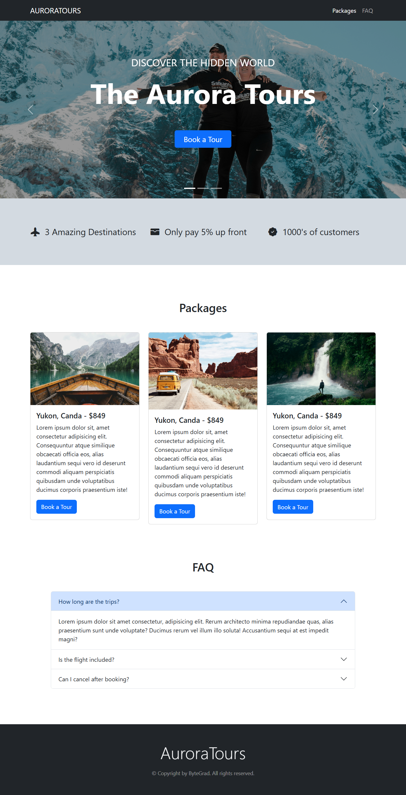

# AuroraTours 🌌✈️

A simple travel landing page project built to practice **Bootstrap 5 basics**.
This project follows the tutorial by [ByteGrad on YouTube](https://youtu.be/b9g4_8nAsdA?si=7Pxlr6hcuCl8kus9).



---

## 🚀 Features

* **Responsive Navbar** with links to *Packages* and *FAQ*.
* **Hero Carousel** with images, captions, and *Book a Tour* modal trigger.
* **Booking Modal** (email + package selection + checkout button).
* **Overview Section** with Bootstrap icons (Destinations, Payment, Customers).
* **Packages Section** styled with Bootstrap cards.
* **FAQ Section** using Bootstrap Accordion.
* **Custom Styling** in `styles.css` for carousel height, image brightness, and overview background.
* **Footer** with branding and copyright.

---

## 🛠️ Built With

* [Bootstrap 5.3](https://getbootstrap.com/) (CDN)
* [Bootstrap Icons](https://icons.getbootstrap.com/)
* HTML5 & CSS3
* Small custom CSS overrides (`styles.css`)

---

## 📂 Project Structure

```
.
├── index.html        # Main page
├── styles.css        # Custom styles
├── website_snapshot.png  # Project preview image
```

---

## 🎯 Learning Goals

This project was created to:

* Understand **Bootstrap’s grid system**.
* Practice **Bootstrap components** (Navbar, Carousel, Modal, Cards, Accordion).
* Learn how to mix **custom CSS** with Bootstrap utilities.

---

## ▶️ How to Run

1. Clone this repo:

   ```bash
   git clone https://github.com/your-username/aurora-tours.git
   ```
2. Open `index.html` in your browser.
3. No build process required — it runs on plain HTML/CSS/Bootstrap.

---

## 📚 Tutorial Reference

This project is based on the tutorial:
**[Build a Bootstrap 5 Website - Full Tutorial](https://youtu.be/b9g4_8nAsdA?si=7Pxlr6hcuCl8kus9)** by ByteGrad.

---

## 📝 License

This project is for **learning purposes only**.
Images are from [Unsplash](https://unsplash.com).
Original tutorial and design credit: **ByteGrad**.

---
