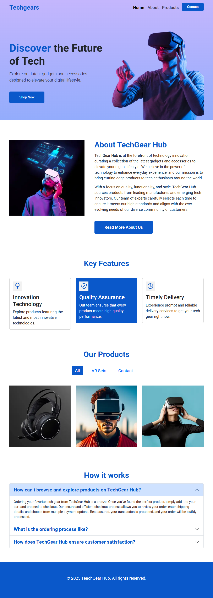

# Techgears 🖥️🎧

A modern landing page project for a **tech gadgets e-commerce store**.
This project was built to practice **Bootstrap 5 (from zero to advanced)** following a YouTube tutorial by **Coding with Sharan**.



---

## 🚀 Features

* **Responsive Navbar** with links (*Home, About, Products, Contact*).
* **Hero Section** with headline, description, CTA button, and image.
* **About Section** with image + text content for company overview.
* **Key Features Section** using Bootstrap cards and Ionicons.
* **Products Section** with **Bootstrap tabs** for filtering (All, VR Sets, Contact).
* **How it Works Section** using **Bootstrap accordion** for FAQs.
* **Footer** with brand name and copyright.
* **Custom Styling** (`style.css`) to add gradients, hover effects, brand colors, and icon styles.

---

## 🛠️ Built With

* [Bootstrap 5.3](https://getbootstrap.com/) (CDN)
* [Ionicons](https://ionic.io/ionicons) for feature icons
* [Google Fonts (Roboto)](https://fonts.google.com/)
* HTML5 & CSS3

---

## 📂 Project Structure

```
techgears/
├── index.html                         # Main page
├── style.css                          # Custom styles
├── assets/
│   ├── hero.webp                      # Hero section image
│   ├── img-1.webp                     # About section image
│   ├── headphones-1.webp              # Product image
│   ├── vr-1.webp                      # Product image
│   ├── vr-2.webp                      # Product image
│   └── screenshot/
│       └── techgears_full_screen_capture.png  # Full-page screenshot
```

---

## 🎯 Learning Goals

This project was created to:

* Practice **Bootstrap 5 advanced features** (tabs, accordion, responsive grid).
* Explore **custom theming** by overriding Bootstrap defaults.
* Integrate external **icons and fonts** for styling.
* Build a modern, responsive landing page layout.

---

## ▶️ How to Run

1. Clone this repo:

   ```bash
   git clone https://www.github.com/michaelndunwa/bootstrap5-from-zero-to-advanced --depth 1 --branch techgears --single-branch ./techgears
   ```
2. Open the folder:

   ```bash
   cd techgears
   ```
3. Open `index.html` in your browser.
4. No build process required — runs on plain HTML/CSS/Bootstrap.

---

## 📚 Tutorial Reference

This project is based on the tutorial:
**[Bootstrap 5.3 Tutorial for Beginners | Learn the Latest Bootstrap in 2024](https://youtu.be/UgfjTV5pEC4?si=v5udVbT0TNO5jB6U)**
by *Coding with Sharan*.

---

## 📝 License

This project is for **learning purposes only**.\
Images are from free stock sources.\
Original tutorial and design credit: **Coding with Sharan**.

